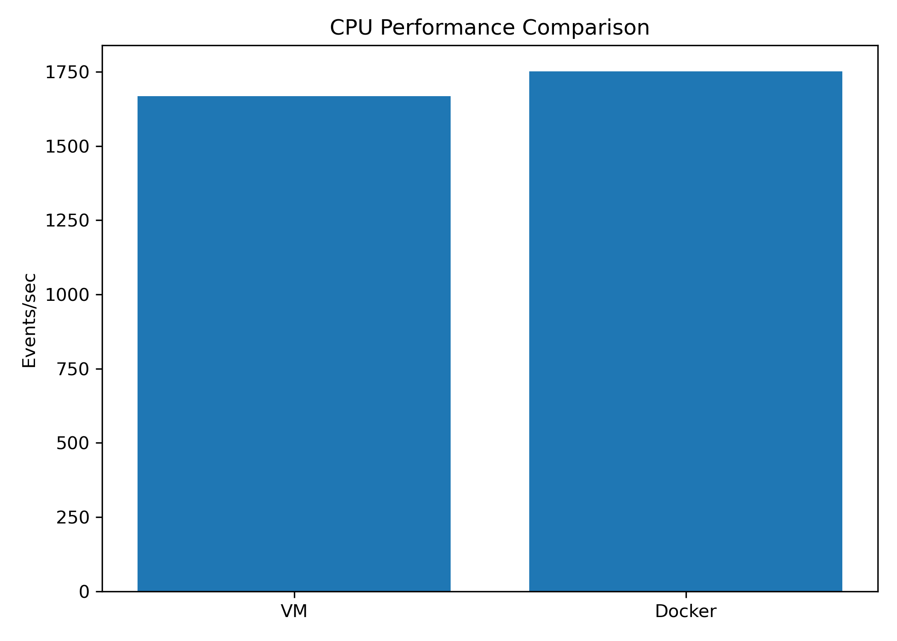
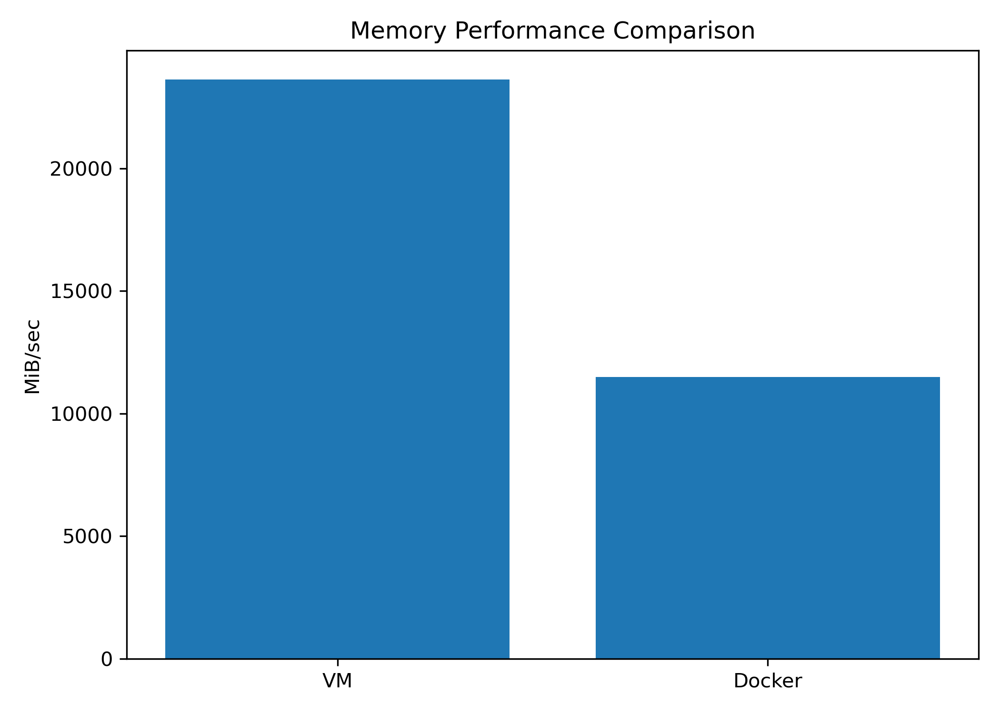
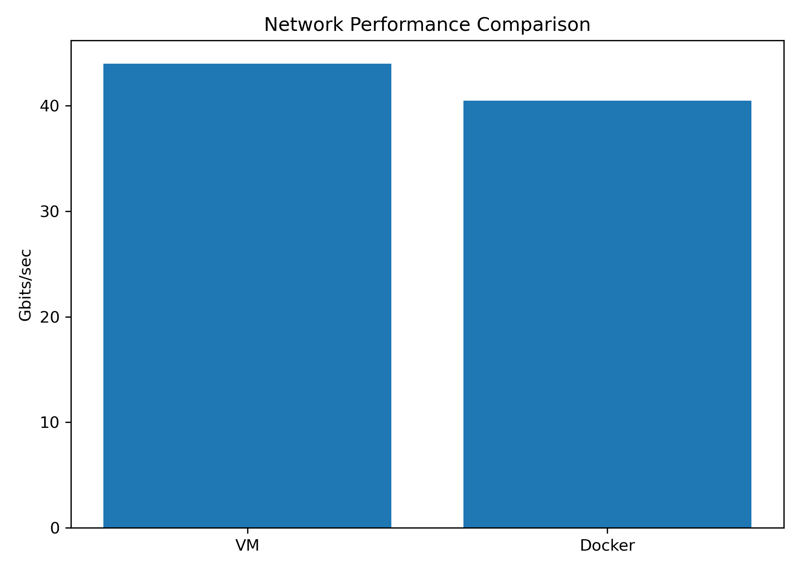
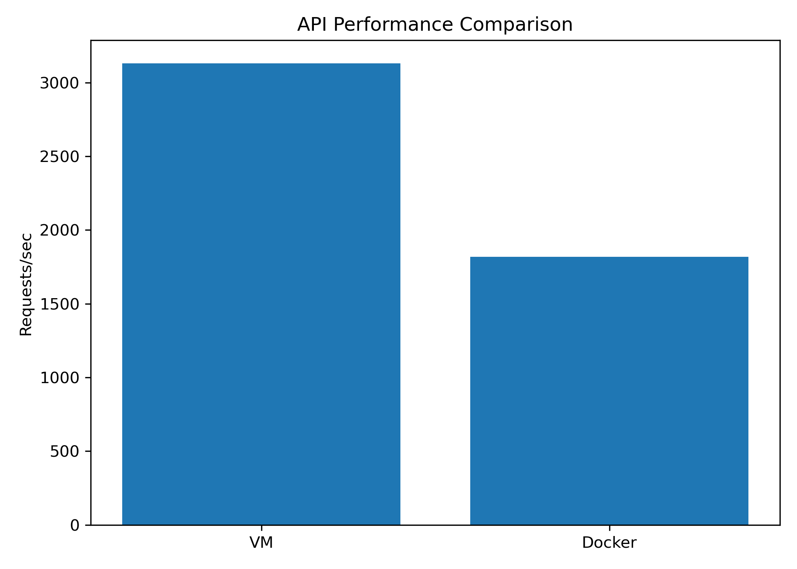

# Performance Analysis of Virtual Machines and Containers

## 1. Objective

To compare the performance of a Virtual Machine (VM) and a Docker container using CPU, memory, disk, network, and application-level benchmarks.

## 2. Experimental Environment

| Component          | Configuration      |
| ------------------ | ------------------ |
| Host OS            | Windows            |
| Hypervisor         | VMware Workstation |
| Guest OS           | Ubuntu 26.04.1 LTS |
| VM CPU             | 2 vCPUs            |
| VM Memory          | 3.27 GiB           |
| VM Disk            | 20 GB              |
| Container Platform | Docker 29.1.3      |
| CPU Benchmark      | Sysbench           |
| Memory Benchmark   | Sysbench           |
| Disk Benchmark     | fio                |
| Network Benchmark  | iperf3             |
| API Benchmark      | ApacheBench (ab)   |
| API Framework      | FastAPI + Uvicorn  |

## 3. Methodology

The same VM environment was used for both VM-side and container-side testing wherever applicable.

Multiple runs were performed for CPU, memory, and disk benchmarks. The average performance was calculated from the valid runs.

The API benchmark used 10,000 requests with concurrency 100 for the `/health` endpoint and 1,000 requests with concurrency 10 for the `/compute` endpoint.

## 4. Results

| Benchmark | Metric       |       VM |   Docker |
| --------- | ------------ | -------: | -------: |
| CPU       | Events/sec   |  1668.10 |  1751.35 |
| Memory    | MiB/sec      | 23629.16 | 11496.33 |
| Disk      | MiB/sec      |   449.60 |   553.20 |
| Network   | Gbits/sec    |     44.0 |     40.5 |
| API       | Requests/sec |  3130.57 |  1818.79 |

## 5. CPU Performance

The CPU benchmark was performed using Sysbench with 2 threads and a 30-second test duration.

The average results were:

* VM: 1668.10 events/sec
* Docker: 1751.35 events/sec

The Docker container produced a slightly higher average CPU throughput in this experiment.

Graph:

## 6. CPU Scalability

CPU scalability was evaluated by increasing the number of CPU threads from 1 to 4.

| Threads | VM (events/sec) | Docker (events/sec) |
| ------: | --------------: | ------------------: |
|       1 |         1001.01 |             1267.42 |
|       2 |         1661.66 |             1178.51 |
|       4 |         1563.64 |             1778.05 |

The results show that CPU throughput does not increase linearly with thread count. The VM has 2 vCPUs, so the 4-thread test introduces thread oversubscription.

Graph:

## 7. Memory Performance

The memory benchmark used a 1 MiB block size, 2 GiB total operation size, and 2 threads.

Average results:

* VM: 23629.16 MiB/sec
* Docker: 11496.33 MiB/sec

The VM produced higher memory throughput in this experiment.

Graph:

## 8. Disk Performance

The sequential write benchmark used fio with a 1 GiB test file, 1 MiB block size, direct I/O, and a 30-second test.

Average valid results:

* VM: 449.60 MiB/sec
* Docker: 553.20 MiB/sec

One VM disk run produced an unusually low result and lasted significantly longer than the other runs. It was treated as an anomalous run and excluded from the representative average; the original raw result is retained in `results/raw/disk/vm/`.

Graph:

## 9. Network Performance

The iperf3 benchmark was performed for 30 seconds.

Results:

* VM: 44.0 Gbits/sec
* Docker: 40.5 Gbits/sec

The Docker test used the Docker bridge network, which resulted in a different networking path from the VM-side test.

This is a local VM-interface benchmark and does not represent Internet bandwidth.

Graph:

## 10. API Performance

FastAPI was tested using ApacheBench.

The `/health` endpoint used:

* 10,000 requests
* Concurrency: 100

The `/compute` endpoint used:

* 1,000 requests
* Concurrency: 10

The final API comparison value represents the combined result of the two API benchmark measurements.

Graph:

Raw API results are stored in:

`results/raw/api/`

## 11. API Scalability

API scalability was evaluated using ApacheBench with the `/health` endpoint and 1,000 total requests at different concurrency levels.

| Concurrency | VM (requests/sec) | Docker (reque
